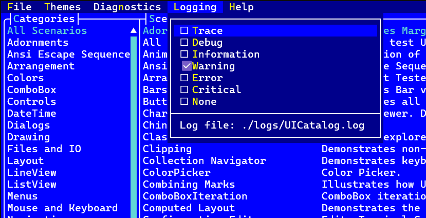

# Logging

Logging has come to Terminal.Gui! You can now enable comprehensive logging of the internals of the library. This can help diagnose issues with specific terminals, keyboard cultures and/or operating system specific issues.

To enable file logging you should set the static property @Terminal.Gui.App.Logging.Logger to an instance of `Microsoft.Extensions.Logging.ILogger`. If your program already uses logging you can provide a shared instance or instance from Dependency Injection (DI).

Alternatively you can create a new log to ensure only Terminal.Gui logs appear.

Any logging framework will work (Serilog, NLog, Log4Net etc) but you should ensure you don't log to the stdout console (File, Debug Output, or UDP etc... are all fine).

## UICatalog

UI Catalog has built-in UI for logging. It logs to both the debug console and a file. By default it only logs at the `Warning` level. 



## Example with Serilog to file

Here is an example of how to add logging of Terminal.Gui internals to your program using Serilog file log.

Add the Serilog dependencies:

```
 dotnet add package Serilog
 dotnet add package Serilog.Sinks.File
 dotnet add package Serilog.Extensions.Logging 
```

Create a static helper function to create the logger and store in `Logging.Logger`:

```csharp
Logging.Logger = CreateLogger();


 static ILogger CreateLogger()
{
    // Configure Serilog to write logs to a file
    Log.Logger = new LoggerConfiguration()
        .MinimumLevel.Verbose() // Verbose includes Trace and Debug
        .WriteTo.File("logs/logfile.txt", rollingInterval: RollingInterval.Day)
        .CreateLogger();

    // Create a logger factory compatible with Microsoft.Extensions.Logging
    using var loggerFactory = LoggerFactory.Create(builder =>
    {
        builder
            .AddSerilog(dispose: true) // Integrate Serilog with ILogger
            .SetMinimumLevel(LogLevel.Trace); // Set minimum log level
    });

    // Get an ILogger instance
    return loggerFactory.CreateLogger("Global Logger");
}
```

This will create logs in your executables directory (e.g.`\bin\Debug\net8.0`).

Example logs:
```
2025-02-15 13:36:48.635 +00:00 [INF] Main Loop Coordinator booting...
2025-02-15 13:36:48.663 +00:00 [INF] Creating NetOutput
2025-02-15 13:36:48.668 +00:00 [INF] Creating NetInput
2025-02-15 13:36:48.671 +00:00 [INF] Main Loop Coordinator booting complete
2025-02-15 13:36:49.145 +00:00 [INF] Run 'MainWindow(){X=0,Y=0,Width=0,Height=0}'
2025-02-15 13:36:49.163 +00:00 [VRB] Mouse Interpreter raising ReportMousePosition
2025-02-15 13:36:49.165 +00:00 [VRB] AnsiResponseParser handled as mouse '[<35;50;23m'
2025-02-15 13:36:49.166 +00:00 [VRB] MainWindow triggered redraw (NeedsDraw=True NeedsLayout=True) 
2025-02-15 13:36:49.167 +00:00 [INF] Console size changes from '{Width=0, Height=0}' to {Width=120, Height=30}
2025-02-15 13:36:49.859 +00:00 [VRB] AnsiResponseParser releasing '
'
2025-02-15 13:36:49.867 +00:00 [VRB] MainWindow triggered redraw (NeedsDraw=True NeedsLayout=True) 
2025-02-15 13:36:50.857 +00:00 [VRB] MainWindow triggered redraw (NeedsDraw=True NeedsLayout=True) 
2025-02-15 13:36:51.417 +00:00 [VRB] MainWindow triggered redraw (NeedsDraw=True NeedsLayout=True) 
2025-02-15 13:36:52.224 +00:00 [VRB] Mouse Interpreter raising ReportMousePosition
2025-02-15 13:36:52.226 +00:00 [VRB] AnsiResponseParser handled as mouse '[<35;51;23m'
2025-02-15 13:36:52.226 +00:00 [VRB] Mouse Interpreter raising ReportMousePosition
2025-02-15 13:36:52.226 +00:00 [VRB] AnsiResponseParser handled as mouse '[<35;52;23m'
2025-02-15 13:36:52.226 +00:00 [VRB] Mouse Interpreter raising ReportMousePosition
2025-02-15 13:36:52.226 +00:00 [VRB] AnsiResponseParser handled as mouse '[<35;53;23m'
...
2025-02-15 13:36:52.846 +00:00 [VRB] Mouse Interpreter raising ReportMousePosition
2025-02-15 13:36:52.846 +00:00 [VRB] AnsiResponseParser handled as mouse '[<35;112;4m'
2025-02-15 13:36:54.151 +00:00 [INF] RequestStop ''
2025-02-15 13:36:54.151 +00:00 [VRB] AnsiResponseParser handled as keyboard '[21~'
2025-02-15 13:36:54.225 +00:00 [INF] Input loop exited cleanly
```

## Metrics

If you are finding that the UI is slow or unresponsive - or are just interested in performance metrics. You can see these by installing the `dotnet-counter` tool and running it for your process.

```
dotnet tool install dotnet-counters --global
```

```
 dotnet-counters monitor -n YourProcessName --counters Terminal.Gui
```

Example output:

```
Press p to pause, r to resume, q to quit.
    Status: Running

Name                                                      Current Value
[Terminal.Gui]
    Drain Input (ms)
        Percentile
        50                                                      0
        95                                                      0
        99                                                      0
    Invokes & Timers (ms)
        Percentile
        50                                                      0
        95                                                      0
        99                                                      0
    Iteration (ms)
        Percentile
        50                                                      0
        95                                                      1
        99                                                      1
        Redraws (Count)                                         9
```

Metrics figures issues such as:

- Your console constantly being refreshed (Redraws)
- You are blocking main thread with long running Invokes / Timeout callbacks (Invokes & Timers)
