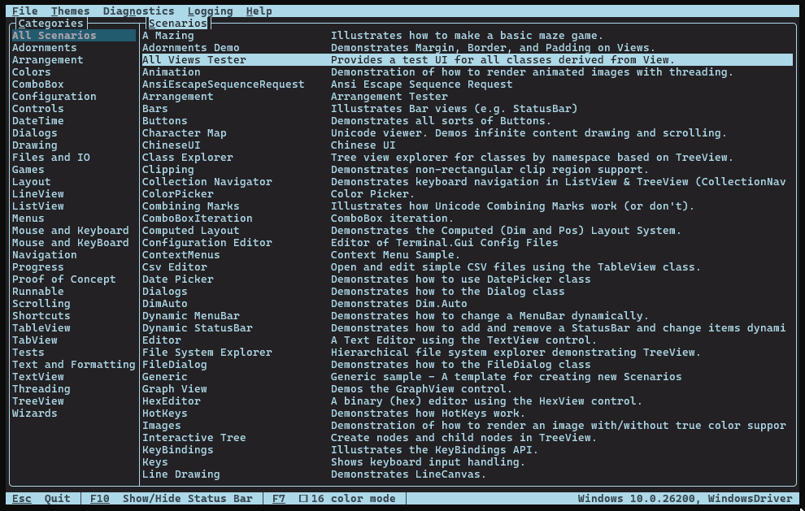

# Terminal.Gui Documentation

Welcome to the official documentation for Terminal.Gui, a cross-platform UI toolkit for creating console-based graphical user interfaces in .NET.

## Key Resources

- [Getting Started](docs/getting-started.md) - Learn how to start using Terminal.Gui.
- [Events Deep Dive](docs/events.md) - Detailed guide on event handling and the Cancellable Work Pattern.
- [View Documentation](docs/View.md) - Information on creating and customizing views.
- [Keyboard Handling](docs/keyboard.md) - Guide to managing keyboard input.
- [Mouse Support](docs/mouse.md) - Details on implementing mouse interactions.
- [Showcase](docs/showcase.md) - Explore applications and examples built with Terminal.Gui.

# Terminal.Gui v2 - Cross Platform Terminal UI toolkit for .NET

A toolkit for building rich console apps for .NET that run on Windows, the Mac, and Linux.

> [!NOTE]
> v2 is still in development (see the `v2_develop` branch). The current stable version of v1 is in the `develop` branch. 



> [!NOTE]
> This is the v2 API documentation. For v1 go here: https://gui-cs.github.io/Terminal.GuiV1Docs/

## Features

* **[Dozens of Built-in Views](~/docs/views.md)** - The library provides a rich set of built-in views that can be used to build complex user interfaces.

* **[Cross Platform](~/docs/drivers.md)** - Windows, Mac, and Linux. Terminal drivers for Curses, Windows, and the .NET Console mean apps will work well on both color and monochrome terminals. Apps also work over SSH.

* **[Templates](~/docs/getting-started.md)** - The `dotnet new` command can be used to create a new Terminal.Gui app.

* **[Extensible UI](~/api/Terminal.Gui.ViewBase.View.yml)** - All visible UI elements are subclasses of the `View` class, and these in turn can contain an arbitrary number of sub-views. Dozens of [Built-in Views](~/docs/views.md) are provided.

* **[Keyboard](~/docs/keyboard.md) and [Mouse](~/docs/mouse.md) Input** - The library handles all the details of input processing and provides a simple event-based API for applications to consume.

* **[Powerful Layout Engine](~/docs/layout.md)** - The layout engine makes it easy to lay out controls relative to each other and enables dynamic terminal UIs. 

* **[Machine, User, and App-Level Configuration](~/docs/config.md)** - Persistent configuration settings, including overriding default look & feel with Themes, keyboard bindings, and more via the [ConfigurationManager](~/api/Terminal.Gui.Configuration.ConfigurationManager.yml) class.

* **[Clipboard support](~/api/Terminal.Gui.App.Clipboard.yml)** - Cut, Copy, and Paste is provided through the [`Clipboard`] class.

* **Multi-tasking** - The [Mainloop](~/api/Terminal.Gui.App.MainLoop.yml) supports processing events, idle handlers, and timers. Most classes are safe for threading.

* **[Reactive Extensions](https://github.com/dotnet/reactive)** - Use reactive extensions and benefit from increased code readability, and the ability to apply the MVVM pattern and [ReactiveUI](https://www.reactiveui.net/) data bindings. See the [source code](https://github.com/gui-cs/Terminal.GuiV2Docs/tree/master/ReactiveExample) of a sample app.

See [What's New in V2 For more](~/docs/newinv2.md).

## Examples

The simplest application looks like this:

```csharp
using Terminal.Gui;
Application.Init ();
var n = MessageBox.Query (50, 5, "Question", "Do you like TUI apps?", "Yes", "No");
Application.Shutdown ();
return n;
```

This example shows a prompt and returns an integer value depending on which value was selected by the user.

More interesting user interfaces can be created by composing some of the various `View` classes that are included. 

In the example above, @Terminal.Gui.App.Application.Init* sets up the environment, initializes the color schemes, and clears the screen to start the application.

The [Application](~/api/Terminal.Gui.App.Application.yml) class additionally creates an instance of the [Toplevel](~/api/Terminal.Gui.Views.Toplevel.yml) View available in the `Application.Top` property, and can be used like this:

```csharp
using Terminal.Gui;
Application.Init ();
var label = new Label () {
    Title = "Hello World",
    X = Pos.Center (),
    Y = Pos.Center (),
    Height = 1,
};
var app = new Toplevel ();
app.Add (label);
Application.Run (app);
app.Dispose ();
Application.Shutdown ();
```

This example includes a menu bar at the top of the screen and a button that shows a message box when clicked:

```csharp
using Terminal.Gui;
Application.Init ();
var menu = new MenuBar (new MenuBarItem [] {
    new MenuBarItem ("_File", new MenuItem [] {
        new MenuItem ("_Quit", "", () => { 
            Application.RequestStop (); 
        })
    }),
});

var button = new Button () {
    Title = "_Hello",
    X = 0,
    Y = Pos.Bottom (menu),
    Width = Dim.Fill (),
    Height = Dim.Fill () - 1
};
button.Accepting += () => {
    MessageBox.Query (50, 5, "Hi", "Hello World! This is a message box", "Ok");
};

var app = new Toplevel ();
// Add both menu and win in a single call
top.Add (menu, button);
Application.Run (top);
top.Dispose ();
Application.Shutdown ();
```

### UI Catalog

UI Catalog is a comprehensive sample library for Terminal.Gui. It provides a simple UI for adding to the catalog of scenarios.

* [UI Catalog Source](https://github.com/gui-cs/Terminal.Gui/tree/master/UICatalog)

More examples can be found in the [Examples](https://github.com/gui-cs/Terminal.Gui/tree/v2_develop/Examples) directory.

## More Information

See the [Deep Dives](~/docs/index.md) for deep dives into the various features of the library.
